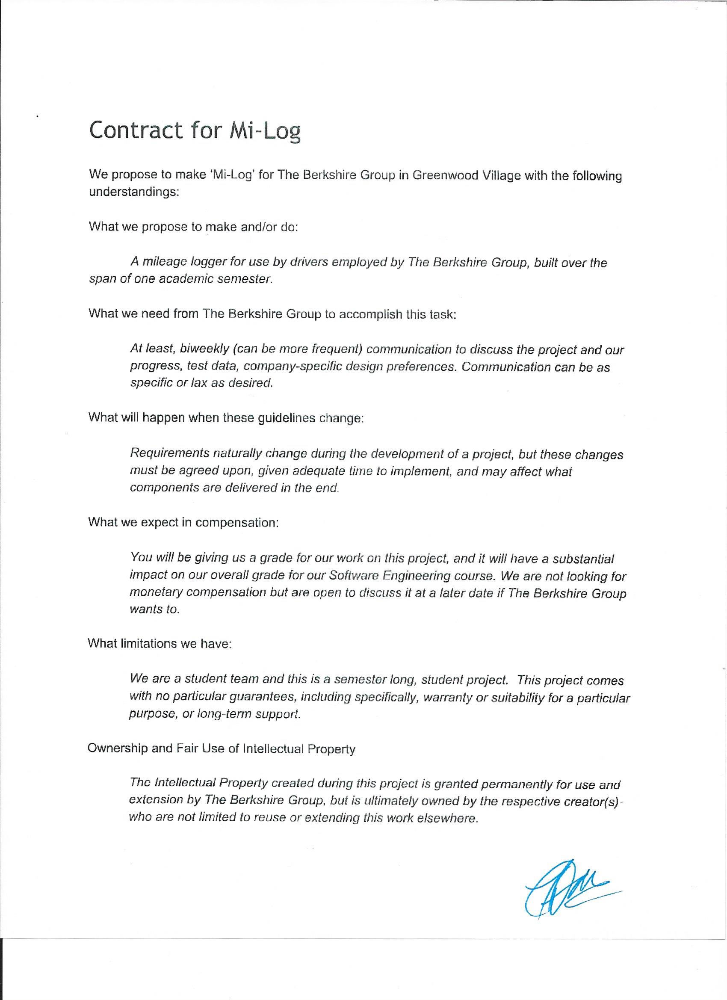
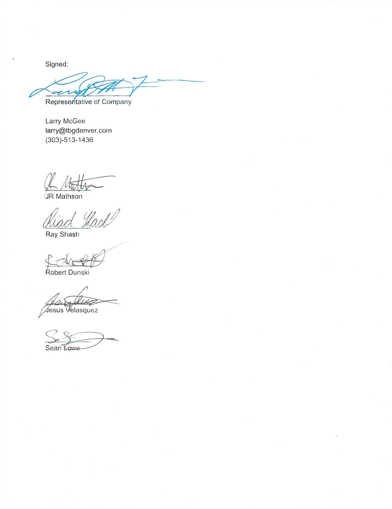

# Mi-Log 
### A mileage tracker for businesses
MiLog is a cross platform mileage logger app built originally for **The Berkshire Group**, a realty company in the Denver area. The app aims to give companies and their employees a convenient way to log trip mileage for budget purposes by prompting drivers to enter their mileage based on the starting and ending odometer reading from the vehicle of choice.

#### Check out our website at https://milog.org

#### Contact us at contact@milog.org or via GitHub

## Navigation

+ <a href="https://github.com/seanlowe/milog/tree/master/src/milog" target="_blank">Flutter source</a>
+ <a href="https://github.com/seanlowe/milog/tree/master/web" target="_blank">Web HTML</a>

+ [Download](https://github.com/seanlowe/milog/releases)

# Developers
<ul>
  <li>James (JR) Mathson <a href="https://github.com/sonofmath" target="_blank">GitHub</a></li> 
  <li>Riad (Ray) Shash <a href="https://github.com/Blackbird002" target="_blank">GitHub</a></li>
  <li>Jesus Velasquez <a href="https://github.com/chewy913" target="_blank">GitHub</a></li>
  <li>Robert Dunski <a href="https://github.com/rdunski" target="_blank">GitHub</a></li>
  <li>Sean Lowe <a href="https://github.com/seanlowe" target="_blank">GitHub</a></li>
</ul>

# Powered By

  
  
  
  
  
  

# Contract

***
### Video Presentation for Client - <a href="https://youtu.be/DlVqtwCDjWU" target="_blank">YouTube Link</a>

